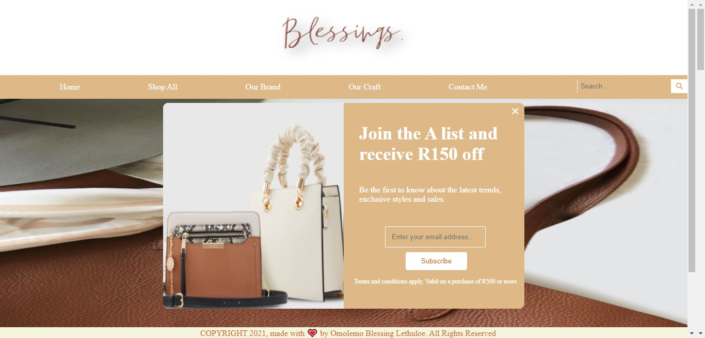
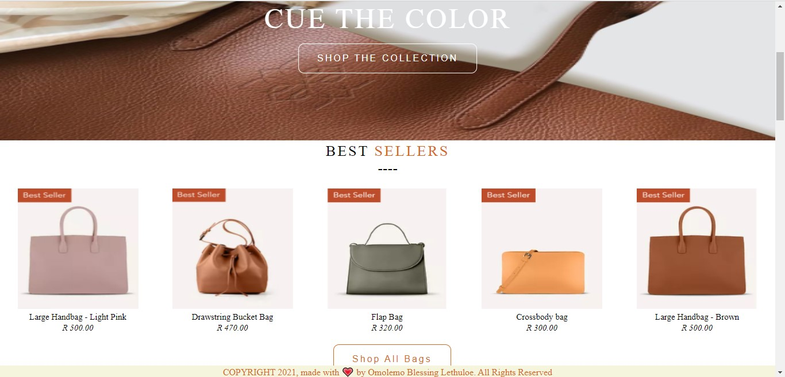

# Blessings

Created a basic dynamic e-commerce website as a task at the GirlCode Software Development Learnership. 


## Project Screenshots




## Live Demo


## Built With

* Visual Studio Code
* CSS
* HTML
* JavaScript

## Tested With
Live Server

## Getting Started

To get a local copy up and running follow these simple steps.

### Prerequisites:
* Code Editor of your choice

### To clone the repo to your local repository:

``` bash
git clone https://github.com/OmolemoBlessingLethuloe/Blessings.web
``` 

``` bash
cd Blessings.web
```

Open ``` home.html ``` in your preferred browser and navigate your way through the website's different pages using: ``` shop-all.html ```; ``` aboutUs.html ```; ``` our-brand.html ```; ``` our-craft.html ```; and ``` contact-us.html ```.

## Authors
OmolemoBlessingLethuloe

## Show your support!
Please give me a ⭐ if you like this project!

## License
[MIT](https://choosealicense.com/licenses/mit/)
